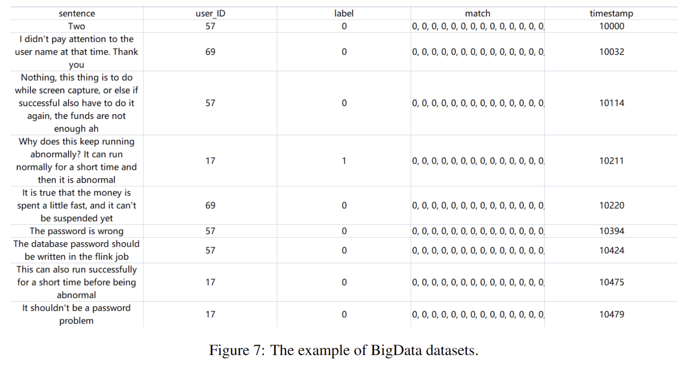

# Dataset introduce

# 1. BigData2022 and BigData2023

The BigData datasets are collected from a course entitled "Big Data Mindset and Analysis," taught at a Chinese university. These datasets stem from group records accumulated over the years 2022 and 2023.

The data format of the BigData datasets is depicted in next Figure. The datasets are stored in the .csv format, encompassing five distinct components: sentence, user\_ID, label, match, and timestamp. The specific data types for each component are detailed below:

Timestamp (integer type): This serves as a timestamp, specifying when a user's statement was made. For computational simplicity, the initial timestamp is set to 10000, representing the time of the first sentence's inception.

User_ID (integer type): This constitutes a unique identification number assigned to each user.

Sentence (string type): This conveys the textual content of a user's chat record.

Label (integer type): This category denotes the nature of a user's chat record. The labels 0, 1, and 2 correspond to noise, a question, and an answer, respectively.

Match (string type): This signifies the matching correlation between the record and the subsequent 100 records. If the current sentence is a question and there is an appropriate answer within the following 100 sentences, it is denoted as 1; otherwise, it is labeled 0.

# 2.Synthetic Dataset

The objective of generating the synthetic dataset is to assess the performance of StyleTimeQAM on larger scale datasets. However, existing QA datasets (such as Wiki QA dataset)  only contains questions and answers, without any conversation timing or user type information. Therefore, we analyze the conversation timing and user type distributions in our own dataset and use similar distributions to generate these features in the synthetic dataset. For textual information, we directly incorporate the questions and answers from the Wiki QA dataset, portraying them as user group statements in synthetic dataset. 

In the generation process of the Synthetic dataset, we adhere to the following principles:

Principle 1:The probability distribution of conversation over different dates in the Synthetic dataset matches that in the BigData22 dataset.

Principle 2:The probability distribution of conversation within one day in the Synthetic dataset matches that in the BigData22 dataset.

Principle 3:The probability distribution of time interval between questions and corresponding answers in the Synthetic dataset matches that in the BigData22 dataset. 

Principle 4:The probability of users posing a question in the Synthetic dataset matches that in the BigData22 dataset.

Principle 5:The probability of users providing an answer in the Synthetic dataset matches that in the BigData22 dataset.

Principle 6:The probability of users providing irrelevant information in the Synthetic dataset matches that in the BigData22 dataset.
