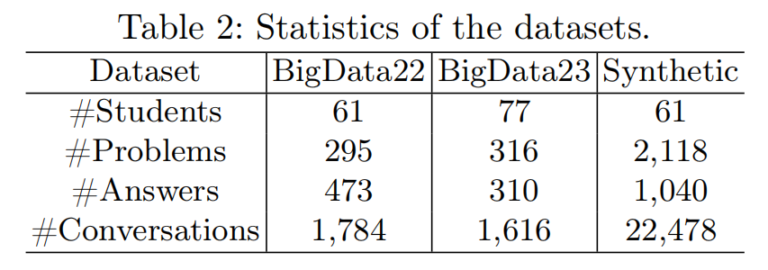
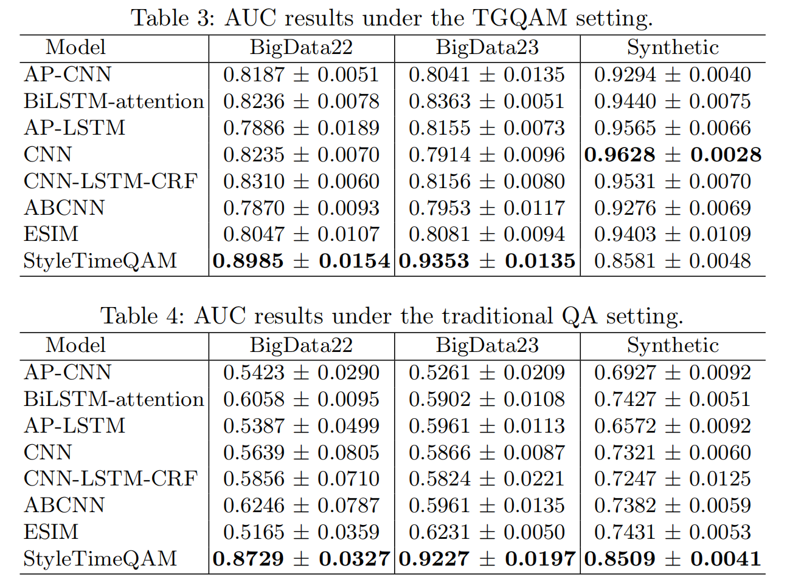
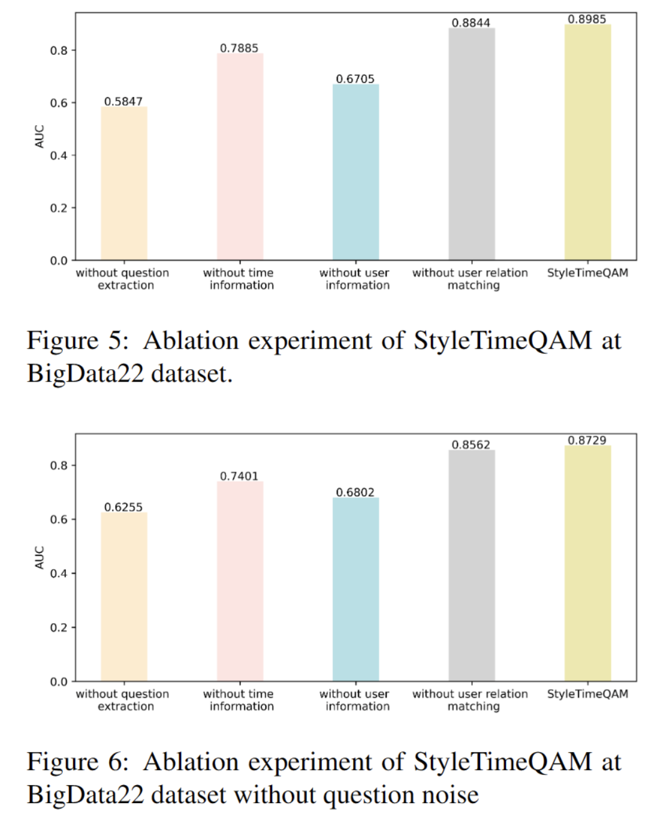

# StyleTimeQAM: Modeling Learning Style and Temporal Dynamics for Question-Answer Matching in Online Teaching Groups
This repository provides the implementation of StyleTimeQAM for Teaching Group Question-Answer Matching (TGQAM).

# 1. Abstract 
We introduce Teaching Group Question-Answer Matching (TGQAM), a new educational task aimed at aligning questions with correct answers in educational groups.
This task is essential for assessing teaching quality and understanding student engagement in online learning.
However, TGQAM faces three challenges: (i) the scarcity of relevant datasets, (ii) the prevalence of unrelated dialogue in teaching groups, and (iii) the wide range of potential answers for each question, making accurate matching difficult.
To address the first challenge, we gather two datasets from an anonymized university course, each of which spans one year, and develop a synthetic dataset that mimics teaching group dynamics, providing a foundational resource for TGQAM research.
To tackle the second and third challenges, we propose StyleTimeQAM, a question-answer matching model that incorporates both student style and temporal information.
It comprises two primary modules: the Learning-Style Aware-Attention Module and the Time-Aware Attention Module.
The Learning-Style-Aware Attention Module filters out irrelevant dialogue by modeling student styles, while the Time-Aware Attention Module leverages a time decay kernel function to reduce irrelevant candidate answers and improve question-answer matching accuracy.
Experimental results demonstrate that StyleTimeQAM achieves strong performance on real teaching-group datasets and confirm the effectiveness of incorporating student style and temporal information into QA matching.

# 2. Install the Requirements of Experiment

    conda create -n STQAM_Env python=3
    conda activate STQAM_Env
    pip install torch
    pip install pandas
    pip install numpy
    pip install scikit-learn
    pip install matplotlib
    pip install seaborn
    
    
 # 3. Running
 ## 3.1 Datasets Selection
Select a dataset you want to include.
There are three datasets: BigData22, BigData23, and Synthetic.

For StyleTimeQAM, the processed datasets are stored under `data/LEA_MODEL/`, such as `bigdata22_train.csv`, `bigdata22_valid.csv`, and `bigdata22_test.csv`.

The dataset format of the baseline and StyleTimeQAM is different.

The dataset for the baseline has three columns, while the dataset for StyleTimeQAM has five columns:

The first column is sentence, which represents the input sentence.

The second column is user_ID, which represents the student who wrote the sentence.

The third column is label, which indicates whether the sentence is a question: 1 denotes a question and 0 denotes a non-question.

The fourth column is match, which represents the matching relationship between the current sentence and the following 100 candidate sentences.

The fifth column is timestamp, which records when the sentence was written.
1 represents a match (the current sentence is the question and the future sentence is the answer), while 0 represents a mismatch.

## 3.2 Running baselines model
We use bigdata22 as an example of a dataset, and CNN as an example of a type of model(with questions noise).

    python Baselines_main.py --dataset_type bigdata22 --model_type CNN --with_label 0

We use bigdata22 as an example of a dataset, and CNN as an example of a type of model(without questions noise).

    python Baselines_main.py --dataset_type bigdata22 --model_type CNN --with_label 1

## 3.3 Running StyleTimeQAM model
We use bigdata22 as an example of a dataset(with questions noise).

    python STQAM_main.py --dataset_type bigdata22 --with_label 0

We use bigdata22 as an example of a dataset(without questions noise).

    python STQAM_main.py --dataset_type bigdata22 --with_label 1

# 4. Results
## 4.1 Experiment Results

## 4.2 Basic configurations about baselines

In our setting, the batch_size is 128, the max_length is 50, and the dropout is 0.5.

The first table shows the baseline configurations under the TGQAM setting:

||bigdata22|bigdata23|synthetic|
|---|---|---|---|
|AP-CNN |`wd`: 1e-5, `lr`: 1e-3 | `wd`: 5e-6, `lr`: 5e-4| `wd`: 1e-5, `lr`: 1e-4|
|BiLSTM-attention|`wd`: 1e-5, `lr`: 5e-4|`wd`: 5e-6, `lr`: 5e-4 |`wd`: 1e-4, `lr`: 5e-3 |
|AP-LSTM|`wd`: 1e-5, `lr`: 5e-5 |`wd`: 1e-6, `lr`: 5e-3 |`wd`: 5e-5, `lr`: 1e-4 | 
|CNN|`wd`: 5e-5, `lr`: 5e-4 |`wd`: 5e-6, `lr`: 1e-3 |  `wd`: 1e-4, `lr`:5e-5| 
|CNN-LSTM-CRF|`wd`: 1e-5, `lr`: 5e-3 | `wd`: 1e-6, `lr`: 5e-4| `wd`: 1e-4, `lr`: 5e-3|
|ABCNN|`wd`: 1e-6, `lr`: 1e-4 | `wd`: 5e-6, `lr`: 1e-3|`wd`: 5e-5, `lr`:5e-3 | 
|ESIM|`wd`: 1e-5, `lr`: 1e-4 | `wd`: 1e-5, `lr`: 5e-4|`wd`: 1e-4, `lr`: 5e-4|

The second table shows the baseline configurations under the traditional QA setting:

||bigdata22|bigdata23|synthetic|
|---|---|---|---|
|AP-CNN |`wd`: 5e-5, `lr`: 1e-4 | `wd`: 1e-5, `lr`: 1e-4| `wd`: 1e-5, `lr`: 5e-4|
|BiLSTM-attention|`wd`: 5e-5, `lr`: 1e-3|`wd`: 1e-6, `lr`: 1e-3 |`wd`: 1e-5, `lr`: 1e-3 |
|AP-LSTM|`wd`: 5e-5, `lr`: 1e-4 |`wd`: 1e-6, `lr`: 1e-3 |`wd`: 1e-4, `lr`: 5e-3 | 
|CNN|`wd`: 5e-5, `lr`: 5e-3 |`wd`: 5e-6, `lr`: 1e-3 | `wd`: 1e-5, `lr`:1e-3| 
|CNN-LSTM-CRF|`wd`: 5e-5, `lr`: 1e-3 | `wd`: 5e-5, `lr`: 1e-4| `wd`: 1e-5, `lr`: 5e-4|
|ABCNN|`wd`: 1e-5, `lr`: 5e-5 | `wd`: 1e-6, `lr`: 5e-4|`wd`: 1e-4, `lr`:5e-4 | 
|ESIM|`wd`: 1e-5, `lr`: 5e-3| `wd`: 1e-5, `lr`: 5e-4|`wd`: 1e-5, `lr`: 5e-5|

## 4.3 Ablation experiment

The experimental results reveal that the removal of question extraction, time-awareness, and user learning styles significantly affects model performance. Conversely, the existence or removal of the user relation matching module only slightly influences the model's effectiveness. This effect can be attributed to the fact that user learning style information is already embedded in the distributed representation of the conversation within the style-aware attention module. Therefore, the conversation relation matching process takes into account user learning styles, and user relation matching simply complements this process. 
