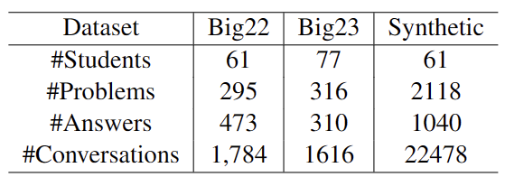

# StyleTimeQAM: A Novel Approach to Teaching Group Question-Answer Matching in Online Education
This repository is the official implementation of the Teaching Group Question-Answering Matching (TGQAM).

# 1. Abstract 
This paper introduces a novel task in the field of education, Teaching Group Question-Answer Matching (TGQAM). 
This task is critical in online education systems for assessing teaching quality and identifying students' learning styles and engagement levels.
However, TGQAM encounters significant challenges, primarily the scarcity of public conversation datasets encapsulating the unique features of teaching group communities and 
the extreme noise in the data. To counter the first hurdle, we collected and made public a conversation dataset from a course at a Chinese university, 
spanning two years. The second challenge arises from the mingling of questions with other conversations and a vast pool of potential answers per question.
Consequently, we introduced StyleTimeQAM, a User Style-Aware and Time-Aware Question Answering Matching Model. 
Experimental results across three datasets reveal that StyleTimeQAM outperforms baseline models, underscoring the effectiveness of the user style-aware and time-aware attention modules.

# 2. Install the Requirments of Experiment

    conda create -n STQAM_Env python=3
    conda activate STQAM_Env
    pip install torch
    pip install pandas
    pip install numpy
    pip install scikit-learn
    pip install matplotlib
    pip install seaborn
    
    
 # 3. Running
 ## 3.1 Datasets Selection
Select a dataset you want to include.
There are four kinds of dataset

`data/<dataset>/<dataset>_<kind>_<seed>.csv`

The dataset format of the baseline and STQAM is different.

The dataset for the baseline has three columns:

The dataset for the STQAM has five columns:

The first column is sentencen.Represents the entered sentence.

The second column is user_ID.Represents which student spoke this sentence.

The third column is label.Represents whether the sentence is a problem, 1 is a problem and 0 is not a problem.

The forth column is match.Represents the matching relationship of this sentence to 100 sentences in the future.
1 represents the match (this sentence is the question, the future sentence is the answer). 0 means mismatch

# 3.2 Running baselines model
We use bigdata22 as an example of a dataset.and CNN as an example of a type of model.

    python Baselines_main.py --dataset_type bigdata22 --model_type CNN

# 3.2 Running STQAM model
We use bigdata22 as an example of a dataset.

    python STQAM_main.py --dataset_type bigdata22
